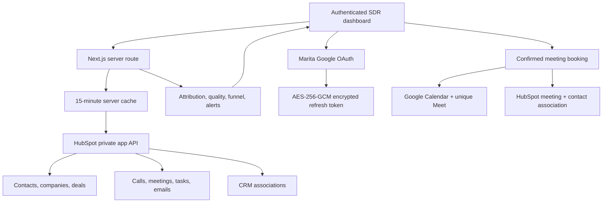
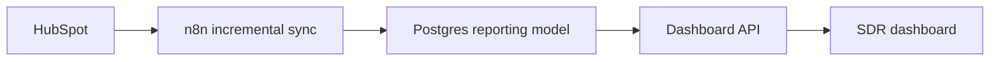

# Architecture

## Design decisions

1. The private app token only exists on the server.
2. HubSpot remains the system of record; drill-down links open original records.
3. Contact cohort filters use associations to align activities and pipeline.
4. Meetings are deduplicated before performance metrics are calculated.
5. Optional sources fail visibly with warnings instead of being treated as zero without explanation.
6. Synthetic demo mode supports UI development and CI without CRM access.
7. Google Calendar only accepts the configured Marita email and uses OAuth state validation.
8. Calendar events are created without guests first; after HubSpot logging succeeds, Sales and Lead are added with notifications enabled.
9. The encrypted refresh token is stored in a dedicated Docker volume so container rebuilds do not disconnect Calendar.

## Production scale

For one SDR, server-side HubSpot aggregation is simple and sufficient. At team scale, use n8n change extraction and Postgres materialized reporting tables:

Recommended tables: `contacts_snapshot`, `companies_snapshot`, `activities`, `activity_contacts`, `deals_snapshot`, `contact_deals`, `owners`, and `sync_runs`. Keep assignment history in a separate append-only event table so past SDR performance does not change when owners change later.
