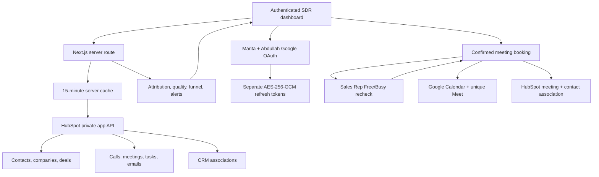
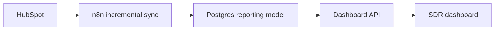

# Architecture

```mermaid
flowchart TD
    UI["Authenticated SDR dashboard"] --> API["Next.js server route"]
    API --> Cache["15-minute server cache"]
    Cache --> HS["HubSpot private app API"]
    HS --> CRM["Contacts, companies, deals"]
    HS --> ENG["Calls, meetings, tasks, emails"]
    HS --> ASSOC["CRM associations"]
    API --> AGG["Attribution, quality, funnel, alerts"]
    AGG --> UI
    UI --> OAUTH["Marita + Abdullah Google OAuth"]
    OAUTH --> TOKENS["Separate AES-256-GCM refresh tokens"]
    UI --> BOOK["Confirmed meeting booking"]
    BOOK --> FB["Sales Rep Free/Busy recheck"]
    FB --> BOOK
    BOOK --> GCAL["Google Calendar + unique Meet"]
    BOOK --> HSM["HubSpot meeting + contact association"]
```

## Design decisions

1. The private app token only exists on the server.
2. HubSpot remains the system of record; drill-down links open original records.
3. Contact cohort filters use associations to align activities and pipeline.
4. Meetings are deduplicated before performance metrics are calculated.
5. Optional sources fail visibly with warnings instead of being treated as zero without explanation.
6. Synthetic demo mode supports UI development and CI without CRM access.
7. Google Calendar only accepts the configured email for the selected organizer and binds that organizer to the validated OAuth state cookie.
8. Calendar events are created without guests first; after HubSpot logging succeeds, Sales and Lead are added with notifications enabled.
9. Each organizer has a separate encrypted refresh token in the dedicated Docker volume. The legacy single-token store maps to Marita automatically, so upgrading does not disconnect her Calendar.
10. Sales Rep Free/Busy is checked during invitation preview and rechecked on the server immediately before any Calendar or HubSpot record is created.
11. A busy calendar, missing cross-domain sharing, missing OAuth scope, or expired token blocks booking explicitly; unavailable never falls back to free.

## Production scale

For one SDR, server-side HubSpot aggregation is simple and sufficient. At team scale, use n8n change extraction and Postgres materialized reporting tables:

```mermaid
flowchart LR
    HS["HubSpot"] --> N8N["n8n incremental sync"]
    N8N --> PG["Postgres reporting model"]
    PG --> API["Dashboard API"]
    API --> UI["SDR dashboard"]
```

Recommended tables: `contacts_snapshot`, `companies_snapshot`, `activities`, `activity_contacts`, `deals_snapshot`, `contact_deals`, `owners`, and `sync_runs`. Keep assignment history in a separate append-only event table so past SDR performance does not change when owners change later.
